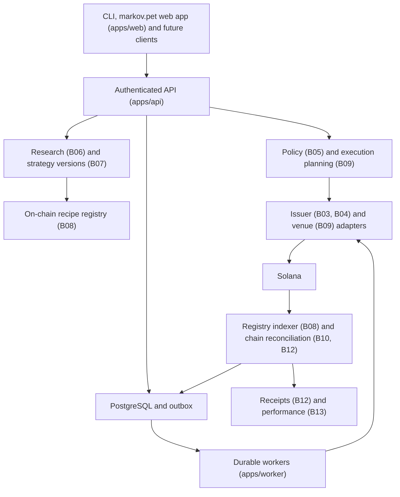

# Architecture

Status: implementation baseline established in session B01. Sections marked
*planned* describe agreed design that has no code yet.

## Topology



Independently runnable processes: `apps/api` (Fastify), `apps/worker`
(Temporal), `apps/indexer` (registry indexer, B08) and `apps/cli`
(operator/developer commands).

## Stack (decided in ADR-0002 and ADR-0003)

| Layer              | Choice                                                         |
| ------------------ | -------------------------------------------------------------- |
| Runtime/build      | Node 22 LTS, TypeScript 5.9 strict, ESM (NodeNext), pnpm 10 workspace with a frozen lockfile |
| HTTP API           | Fastify 5, zod-validated contracts, generated OpenAPI 3.1     |
| Persistence        | PostgreSQL 16, Drizzle for mapping, reviewed SQL migrations   |
| Durable execution  | Temporal TypeScript SDK 1.24; outbox table `outbox_events` recording execution state changes (B10), not yet relayed by any process |
| Chain access       | Minimal bounded JSON-RPC client (B01) and SDK-free wire formats in `@markov/solana-codec` (ADR-0009, resolves OD-01) |
| Identity           | Provider-neutral identity-token verifier (issuer, audience, JWKS) in `@markov/auth` (B02); production provider account (existing provider or Privy) open (OD-05) |
| Evidence           | Ed25519-signed receipts with verification keys at `GET /v1/receipts/keys`, signed by a local key that production refuses (B12); KMS signer (OD-22) and private S3-compatible evidence storage planned |
| Telemetry          | pino structured redacted logs (B01); OpenTelemetry (planned)  |
| Delivery           | CI in GitHub Actions (`.github/workflows/ci.yml`, SHA-pinned actions), whose runs start with P01; web app (staging mode, no backend reachable) and documentation site on Vercel (OD-11, OD-24; `operations.md`, "Frontends on Vercel"); backend services on Railway, selected but not provisioned (no Dockerfile or `railway.json` yet; OD-11, P02) |

## Repository layout

```
apps/api            Fastify domain API
apps/worker         Temporal worker and workflows
apps/indexer        registry indexer: follows publications to finality and mirrors program records (B08)
apps/cli            markov command line
packages/contracts  zod schemas shared by everything (bottom of the graph)
packages/config     strict env parsing and runtime-mode invariants
packages/observability  logger with redaction
packages/solana-rpc bounded JSON-RPC client and network identity verification
packages/db         pooled client, migrations, platform identity, capability readiness, identity, catalog, policy, research, watchlist, strategy, registry, follow, planning, execution, accounting, analytics and discovery stores
packages/auth       identity-token verification, wallet ownership challenges, credentials, principals (B02)
packages/catalog    pure catalog rules: feed validation, ingestion planning, mint parsing, availability (B03)
packages/issuer-prestocks  PreStocks issuer source: fixtures and bounded configured-URL feed (B03)
packages/issuer-xstocks    xStocks issuer source: product and corporate-action feeds, fixtures and bounded URLs (B04)
packages/amounts    exact BigInt decimals, on-chain double conversion, raw/scaled quantities (B04)
packages/policy     pure eligibility, limits, capability-state and policy evaluation rules (B05)
packages/research   pure research rules: thesis validation, safe-retrieval policy, sanitiser, mapping, model adapter contract (B06)
packages/strategy   pure recipe rules: exact-weight validation, admission snapshots, canonical manifest and content digest, version diff (B07)
packages/solana-codec  pure Solana wire formats: base58/base64, Ed25519, derived and associated-token addresses, token layouts, legacy and v0 messages with lookup tables, signing, and the in-memory fixture chain executing real bytes (B10, ADR-0009)
packages/registry   registry SDK: program-derived addresses, instruction and account encodings, rules mirror, publication state machine, the registry program's fixture executor (B08)
packages/planning   pure execution planning: largest-remainder base-unit allocation, beta fee policy, quote checks and the reviewed route/program matrix, plan assembly with bounds, validity and the atomic-or-staged grouping from composition evidence, canonical plan hash, intent state machine with staged transitions (B09, B11)
packages/venue-jupiter  venue adapters answering the Markov quote, build and compose contracts: synthetic fixture venue with its route program semantics and whole-basket composition (local/test) and bounded configured-URL gateway (quote and build only); live Jupiter interface BLOCKED (OD-21) (B09, B10, B11)
packages/execution  pure execution rules: exhaustive instruction decoding, multi-leg transaction validation against the plan, signed-submission checks, reconciliation decisions from chain evidence with staged and partial outcomes, fills per leg from transaction meta (B10, B11)
packages/accounting pure accounting rules: append-only quantity journal balanced per asset, fill/fee/rent entries with idempotent source references, FIFO lots and consumptions, intent attribution to instances, chain reconciliation into external-flow entries and checkpoints, canonical signed receipts and their verification (B12)
packages/analytics  pure performance analytics: typed price resolution with freshness and kind precedence, valuation with historical multipliers, model and actual series on a daily grid with flow points, time-weighted and Modified Dietz returns, drawdown, turnover, P&L, completeness and model-only rankings, exact rational arithmetic (B13)
packages/agent-tools pure agent tool rules: the typed tool catalog with its scope matrix, strict input validation, canonical digests and identifier-only provenance summaries, budget accounting, denial explanations, the bounded companion adapter contract and its deterministic fixture (B15)
packages/maintenance pure maintenance rules: time-zone-aware cadences and occurrence generation, due occurrences under missed-run policies, drift decisions and leg sizing, the mandate envelope evaluator (B16)
packages/notifications pure notification rules: event and schedule-outcome routing, channel selection from preferences, credential-free rendering, verification hashing, the email adapter contract with its recording fixture and the configured HTTP adapter, retry backoff (B16)
packages/model-xai  xAI (Grok) adapters for the research and companion model contracts over the OpenAI-compatible chat completions API: bounded client with redacted errors and per-token pricing, strict JSON parsing, deterministic post-validation; no provider SDK (B17)
programs/strategy-registry  Anchor program recording immutable version recipes, program-test suite and shared vectors (B08); programs/idl-build generates its IDL
packages/api-client generated OpenAPI client with runtime contract validation, used by the app server (F03)
packages/testkit    test-only helpers (never imported by production code)
apps/web            markov.pet application (Next.js App Router; ADR-0006)
apps/docs           markov.pet/docs documentation site (Docusaurus), generated from the repository at build time (D01)
packages/ui         design system (tokens, primitives, forms, feedback, tables)
packages/markov-shell  Mark I shell (@markov/shell): device frame, pixel eyes, companion presence, top bar, navigation (F02)
packages/formatters exact amount, basis-point, price, time and address formatting
tooling/            commit policy, boundary checker, secret scan, scripts
docs/markov         this contract, ADRs, registers
docs/sessions       per-session evidence
```

Receipts, the quantity journal and holdings live in `@markov/accounting`
(B12) and valuation and performance in `@markov/analytics` (B13); provider
integrations are per-provider packages (`issuer-prestocks`,
`issuer-xstocks`, `venue-jupiter`, `model-xai`). Planned: the Railway
deployment artifacts (a root multi-stage `Dockerfile` with one target per
process, `.dockerignore`, `railway.json`; P02, OD-11).

## Dependency direction

`apps → packages → contracts/pure utilities`. Apps never import other apps.
The web app and the frontend packages import only `@markov/contracts` and
each other; `appDeny` in the rules file keeps databases, configuration, RPC
clients and signers out of the browser build (ADR-0006).
`@markov/contracts` imports nothing internal. Provider SDK families are
restricted to their owning package (`tooling/boundaries/rules.json`);
`@jup-ag/*`, `@meteora-ag/*` and the `@solana/` scope have no owner, except
`@solana/wallet-standard-features` and `@solana/wallet-standard-chains`,
which only `@markov/web` may import (ADR-0007), so importing any other of
them fails the check (ADR-0009 keeps the Solana wire formats in
`@markov/solana-codec` without an SDK); the venue adapter talks to a gateway
with plain `fetch` through the Markov quote and build contracts and uses no
provider SDK. Domain packages never depend on `@markov/db`: the execution
lifecycle drives a structurally typed store port that the API and the worker
both implement over the database. `pnpm boundaries:check` is part of
`pnpm verify` and a step of the CI workflow (`.github/workflows/ci.yml`),
whose runs start with P01.

## Runtime modes

| MARKOV_ENV         | Allowed clusters                          | Execution writes                            |
| ------------------ | ----------------------------------------- | ------------------------------------------- |
| local              | localnet, devnet, testnet, mainnet-beta   | allowed except on mainnet-beta              |
| test               | localnet, devnet, testnet                 | allowed                                     |
| staging            | devnet, testnet, mainnet-beta             | allowed except on mainnet-beta              |
| mainnet-read-only  | mainnet-beta                              | never                                       |
| production         | mainnet-beta                              | only with every BETA_* cap, allowlist and release evidence |

Additional invariants enforced by `@markov/config`: production requires
Temporal TLS, a non-default Temporal namespace, database SSL and JSON logs;
staging, mainnet-read-only and production require an independent secondary
RPC host; plain-http RPC is loopback-only; CORS origins are exact origins,
never wildcards; a genesis-hash override that contradicts the reviewed
constant for a public cluster is rejected.

## Boot sequence (implemented in B01)

1. Parse and validate configuration; exit 78 (`EX_CONFIG`) listing every issue.
2. Ping the database; exit 69 (`EX_UNAVAILABLE`) if unreachable.
3. Compare applied migrations with the bundled journal; exit 78 unless current.
4. Read the single `platform_identity` row. Exit 78 if unbound or if its
   `markov_env`, `solana_cluster` or `genesis_hash` differ from configuration.
   For localnet without a pinned genesis the stored hash becomes the expectation.
5. Ask every configured RPC endpoint for `getGenesisHash`. Any contradiction
   exits 78. No answer starts the process in a not-ready state; a background
   monitor re-verifies every 15 seconds and readiness reports `unverified`.
6. Listen. `SIGTERM`/`SIGINT` stop accepting connections, drain within
   `SHUTDOWN_TIMEOUT_MS`, close the pool and exit 0.

The worker runs steps 1 to 4, then connects to Temporal with bounded retries.

## Health contract

- `GET /healthz`: liveness only.
- `GET /readyz`: `database`, `schema`, `platform_identity` and `solana_rpc`
  checks; 200 only when all pass; `unverified` is distinct from `fail`.
- `GET /v1/platform`: identity and capability readiness, secret-free.
- `GET /openapi.json`: generated document; `docs/markov/openapi.json` is the
  committed copy checked for drift by `pnpm openapi:check` (part of
  `pnpm verify` and a step of the CI workflow).

## Data and queues

PostgreSQL is the financial source of truth. Denormalized views must be
rebuildable. Migrations follow expand/backfill/contract. Queue delivery is
at-least-once. The outbox (`outbox_events`, migration `0011_execution`, B10)
records execution state changes (`execution.pending` in the same
transaction as the attempt it announces); no relay publishes it yet. The
notification projection (B16, `0017_maintenance`) consumes the Mark I event
log idempotently through its cursor and unique indexes (one notification per
source event, one delivery per channel), and every email request carries an
idempotency key. Temporal replay supplies workflow
continuity, not exactly-once external effects. Redis, if ever used, is a
cache, never the source of truth.

## What is explicitly not built

No matching engine, custom DEX, pooled vault, bridge, perps engine or
arbitrary agent runtime. A market buy routed through an AMM is never
represented as a resting order on an order book.
