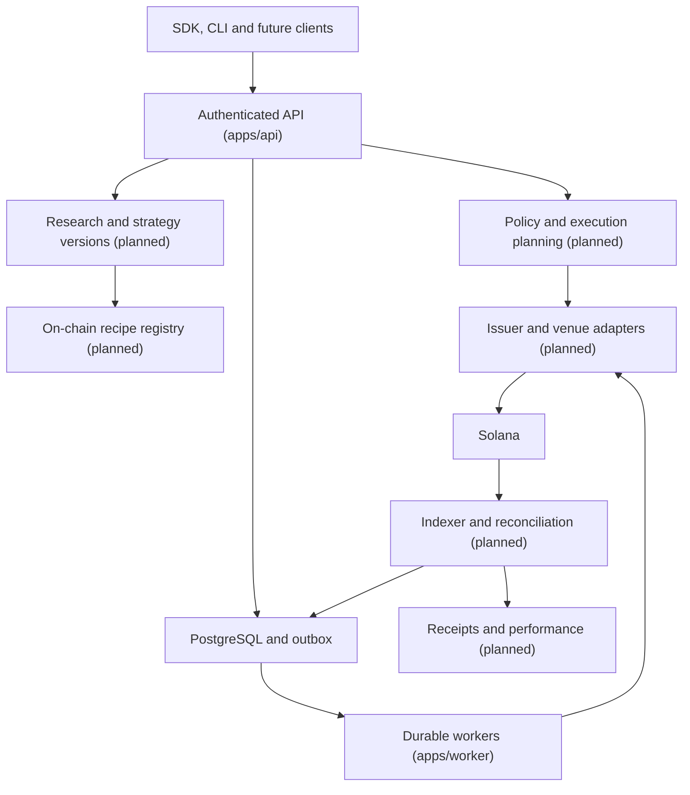

# Architecture

Status: implementation baseline established in session B01. Sections marked
*planned* describe agreed design that has no code yet.

## Topology



Independently runnable processes: `apps/api` (Fastify), `apps/worker`
(Temporal), `apps/cli` (operator/developer commands). `apps/indexer` is
introduced with the registry in B08.

## Stack (decided in ADR-0002 and ADR-0003)

| Layer              | Choice                                                         |
| ------------------ | -------------------------------------------------------------- |
| Runtime/build      | Node 22 LTS, TypeScript 5.9 strict, ESM (NodeNext), pnpm 10 workspace with a frozen lockfile |
| HTTP API           | Fastify 5, zod-validated contracts, generated OpenAPI 3.1     |
| Persistence        | PostgreSQL 16, Drizzle for mapping, reviewed SQL migrations   |
| Durable execution  | Temporal TypeScript SDK 1.24; transactional outbox (planned)  |
| Chain access       | Minimal bounded JSON-RPC client (B01); SDK selection open     |
| Identity           | Existing provider or Privy behind an adapter (planned, B02)   |
| Evidence           | Private S3-compatible storage, KMS-signed receipts (planned)  |
| Telemetry          | pino structured redacted logs (B01); OpenTelemetry (planned)  |
| Delivery           | GitHub Actions with SHA-pinned actions; containers (planned)  |

## Repository layout

```
apps/api            Fastify domain API
apps/worker         Temporal worker and workflows
apps/cli            markov command line
packages/contracts  zod schemas shared by everything (bottom of the graph)
packages/config     strict env parsing and runtime-mode invariants
packages/observability  logger with redaction
packages/solana-rpc bounded JSON-RPC client and network identity verification
packages/db         pooled client, migrations, platform identity, capability readiness, identity, catalog, policy and research stores
packages/auth       identity-token verification, wallet ownership challenges, credentials, principals (B02)
packages/catalog    pure catalog rules: feed validation, ingestion planning, mint parsing, availability (B03)
packages/issuer-prestocks  PreStocks issuer source: fixtures and bounded configured-URL feed (B03)
packages/issuer-xstocks    xStocks issuer source: product and corporate-action feeds, fixtures and bounded URLs (B04)
packages/amounts    exact BigInt decimals, on-chain double conversion, raw/scaled quantities (B04)
packages/policy     pure eligibility, limits, capability-state and policy evaluation rules (B05)
packages/research   pure research rules: thesis validation, safe-retrieval policy, sanitiser, mapping, model adapter contract (B06)
packages/api-client generated OpenAPI client with runtime contract validation, used by the app server (F03)
packages/testkit    test-only helpers (never imported by production code)
apps/web            markov.pet application (Next.js App Router; ADR-0006)
packages/ui         design system (tokens, primitives, forms, feedback, tables)
packages/formatters exact amount, basis-point, price, time and address formatting
tooling/            commit policy, boundary checker, secret scan, scripts
docs/markov         this contract, ADRs, registers
docs/sessions       per-session evidence
```

Planned packages follow the specification: allocation, execution,
portfolio, integrations, agent-tools, receipts; `programs/strategy-registry`
for the Anchor program; `infra` for deployment.

## Dependency direction

`apps → packages → contracts/pure utilities`. Apps never import other apps.
The web app and the frontend packages import only `@markov/contracts` and
each other; `appDeny` in the rules file keeps databases, configuration, RPC
clients and signers out of the browser build (ADR-0006).
`@markov/contracts` imports nothing internal. Provider SDK families are
restricted to their owning package (`tooling/boundaries/rules.json`);
`@solana/*`, `@jup-ag/*` and `@meteora-ag/*` currently have no owner, so
importing them fails the check until an ADR assigns one. `pnpm boundaries:check`
runs in CI.

## Runtime modes

| MARKOV_ENV         | Allowed clusters                          | Execution writes                            |
| ------------------ | ----------------------------------------- | ------------------------------------------- |
| local              | localnet, devnet, testnet, mainnet-beta   | allowed except on mainnet-beta              |
| test               | localnet, devnet, testnet                 | allowed                                     |
| staging            | devnet, testnet, mainnet-beta             | allowed except on mainnet-beta              |
| mainnet-read-only  | mainnet-beta                              | never                                       |
| production         | mainnet-beta                              | only with every BETA_* cap, allowlist and release evidence |

Additional invariants enforced by `@markov/config`: production requires
Temporal TLS, a non-default Temporal namespace, database SSL and JSON logs;
staging, mainnet-read-only and production require an independent secondary
RPC host; plain-http RPC is loopback-only; CORS origins are exact origins,
never wildcards; a genesis-hash override that contradicts the reviewed
constant for a public cluster is rejected.

## Boot sequence (implemented in B01)

1. Parse and validate configuration; exit 78 (`EX_CONFIG`) listing every issue.
2. Ping the database; exit 69 (`EX_UNAVAILABLE`) if unreachable.
3. Compare applied migrations with the bundled journal; exit 78 unless current.
4. Read the single `platform_identity` row. Exit 78 if unbound or if its
   `markov_env`, `solana_cluster` or `genesis_hash` differ from configuration.
   For localnet without a pinned genesis the stored hash becomes the expectation.
5. Ask every configured RPC endpoint for `getGenesisHash`. Any contradiction
   exits 78. No answer starts the process in a not-ready state; a background
   monitor re-verifies every 15 seconds and readiness reports `unverified`.
6. Listen. `SIGTERM`/`SIGINT` stop accepting connections, drain within
   `SHUTDOWN_TIMEOUT_MS`, close the pool and exit 0.

The worker runs steps 1 to 4, then connects to Temporal with bounded retries.

## Health contract

- `GET /healthz`: liveness only.
- `GET /readyz`: `database`, `schema`, `platform_identity` and `solana_rpc`
  checks; 200 only when all pass; `unverified` is distinct from `fail`.
- `GET /v1/platform`: identity and capability readiness, secret-free.
- `GET /openapi.json`: generated document; `docs/markov/openapi.json` is the
  committed copy checked for drift in CI.

## Data and queues

PostgreSQL is the financial source of truth. Denormalized views must be
rebuildable. Migrations follow expand/backfill/contract. Queue delivery is
at-least-once; the transactional outbox and idempotent consumers arrive with
the first side-effecting feature (B10/B16). Temporal replay supplies workflow
continuity, not exactly-once external effects. Redis, if ever used, is a
cache, never the source of truth.

## What is explicitly not built

No matching engine, custom DEX, pooled vault, bridge, perps engine or
arbitrary agent runtime. A market buy routed through an AMM is never
represented as a resting order on an order book.
